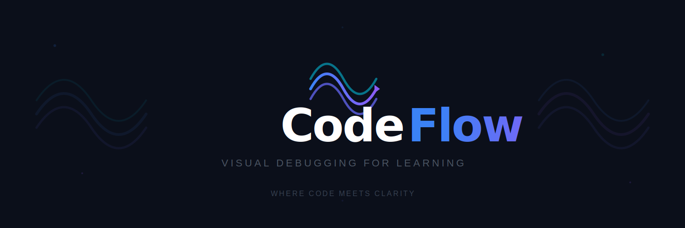

<div align="center">



<br/>

</div>

## 📌 프로젝트 소개

> 알고리즘 학습에서 가장 큰 문제는 “코드가 왜 그렇게 동작하는지”를 이해하기 어렵다는 점이다.
> 기존 플랫폼은 결과만 제공하고, IDE 디버거는 초보자에게 너무 복잡하다.
>
> **CodeFlow**는 코드 실행 과정을 시각적으로 보여주어,
> 학습자가 “결과가 아닌 과정”을 이해할 수 있도록 돕는 디버깅 기반 학습 도구이다.

<br/>

## 🎯 핵심 가치

- 코드의 **결과가 아닌 실행 과정**을 이해한다
- 복잡한 디버거 없이 **직관적인 시각화 경험** 제공
- 초보자를 위한 **학습 중심 디버깅 환경**

<br/>

---

## 🛠 기술 스택

### Frontend


### Backend


### Execution Engine


### Infra


<br/>

<!-- ## 🏗 System Architecture

<div align="center">
  
</div> -->

## ⚙️ 실행 흐름

```text
사용자 코드 실행
    ↓
Docker 컨테이너에서 코드 실행
    ↓
JDI를 통한 라인별 상태 추출
    ↓
SnapshotEvent(JSON) 생성
    ↓
SSE(Server-Sent Events)로 프론트 전송
    ↓
React Flow 기반 시각화
```

---

## 📦 데이터 구조

```ts
export interface SnapshotEvent {
    line: number;
    stack: StackVar[];
    heap: HeapItem[];
    status: 'active' | 'done' | 'error';
    errorLine?: number;
    errorMsg?: string;
    output?: string;
}
```

👉 CodeFlow의 핵심은 “코드”가 아니라
**실행 상태(Snapshot)를 시각화하는 것**이다.

---

## ✨ 주요 기능

<div align="center">

| 기능                       | 설명                               |
| -------------------------- | ---------------------------------- |
| 🧠 **라인별 실행 시각화**  | 코드 실행을 단계별로 추적          |
| 📦 **Stack / Heap 시각화** | 변수와 객체 상태를 직관적으로 표현 |
| ▶ **Step 실행**            | 한 줄씩 실행 흐름 확인             |
| 🔁 **재귀 흐름 시각화**    | Call Stack 구조를 시각적으로 표현  |
| 🎯 **포인터/배열 시각화**  | 투포인터 및 배열 흐름 강조         |
| ⚠️ **에러 위치 표시**      | 오류 발생 라인을 시각적으로 강조   |

</div>

<br/>

---

## 📱 페이지 구조

```text
Home
 └─ 학습 주제 선택 (배열, 재귀, 투포인터)

Visualizer
 └─ 코드 작성 + 실행 + 시각화

Result
 └─ 실행 결과 및 핵심 개념 요약
```

<br/>

---

## 📎 Docs

<div align="center">

| 문서                                      | 설명            |
| ----------------------------------------- | --------------- |
| [🧭 Product Idea](./docs/PRODUCT_IDEA.md) | 제품 방향성     |
| [🤝 Contributing](./docs/CONTRIBUTING.md) | Git 협업 가이드 |
| [📋 Feature Spec](./docs/FEATURE_SPEC.md) | 기능 명세       |

</div>

<!-- | [🏗 Architecture](./docs/ARCHITECTURE.md) | 시스템 구조 |
| [📡 API](./docs/API.md)                   | API 명세 |
| [📦 Snapshot](./docs/SNAPSHOT.md)         | 데이터 구조 |
| [💻 Local Setup](./docs/LOCAL_SETUP.md)   | 개발 환경  | -->

<br/>

---

## 🚀 한 줄 요약

> CodeFlow는 코드 실행 과정을 시각적으로 이해하게 만드는
> **학습 중심 디버깅 도구이다.**

---
